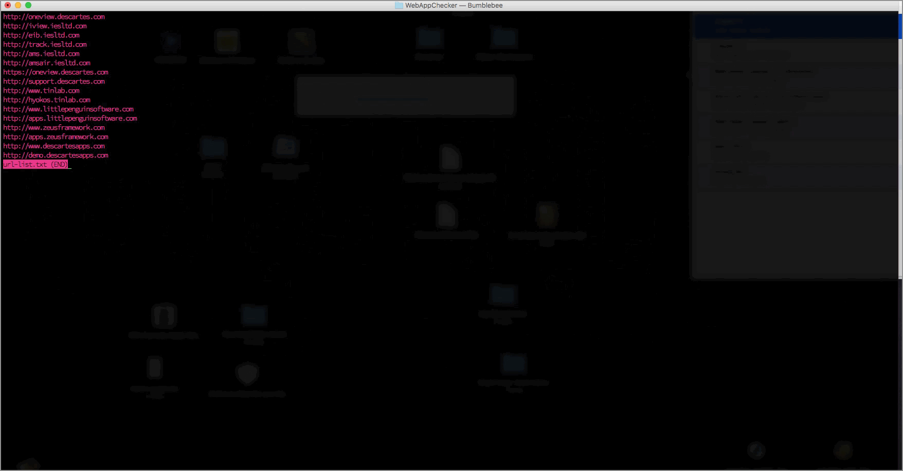

# Checks the status of a list of urls

Usage:

```bash
$ ./check <url>
$ ./check < url-list.txt
```



Runs `GET` requests against the list of URLs and prints:

- status code
- url
- time to complete request
- time to first byte (time_pretransfer - time_starttransfer)

- Tested on OSX up to 10.12.6
